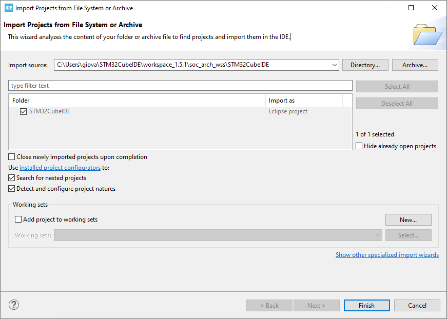
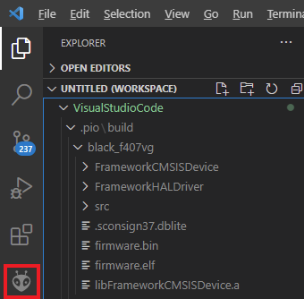
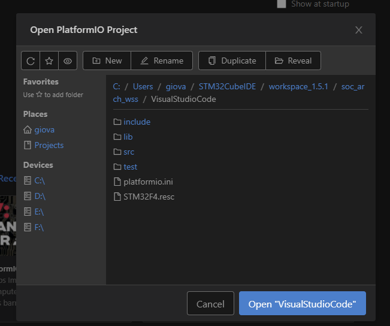

# Well-being Smart Station (WSS)

## Description
*Well-being Station* is a system able to control indoor environment parameters
to keep them within _Comfort Zones_ while at the same time minimizing
the consumed energy.
The logic was implemented in software and it is an infinite iteration of:
sensing (temperature and humidity, both indoor and outdoor), controlling
(elaborate sensed data and control environment conditioning devices
accordingly) and wait.
The underlying hardware is mainly composed of an _STMicroelectronics STM32F4_
board, a couple of temperature and humidity sensors and a set of relays used to
control environment conditioning devices.
In _High Quality Mode_ the system uses all the devices it has at its disposal to
reach the _Comfortable Zone_, while in _ECO Mode_ the system trades-off between
comfort and energy consumption.


## Dependencies
This project depends on: 
* [**Renode Development Framework**](https://renode.io/#downloads)
* [**Visual Studio Code**](https://code.visualstudio.com/download) 
* [**PlatformIO VSC Plugin**](https://platformio.org/platformio-ide)
* [**STM32Cube IDE Development Tool**](https://www.st.com/en/development-tools/stm32cubeide.html)
* [**STM32 Flash Loader**](https://www.st.com/en/development-tools/flasher-stm32.html)

## Quick Start 
In the early stages, the project has been developed on **Visual Studio Code** coupled with
**Renode** development framework, in order to have full access in debug mode. Then, during
the port to the real board, we've switched to **STM32CubeIDE** to have more control on
peripherals and clock configurations.
However, the code is totally interchangable and intercompatible,
so it can be used with both environments, according to our preferences.

1. Import project in preferred environment:
    * Import project in [**STM32CubeIDE**](#Import-project-in-STM32CubeIDE)
    * Import project in [**Visual Studio Code**](#Import-project-in-Visual-Studio-Code)
2. Switch between **Renode** and **DevEBox*** board implementations [**here**](#Switch-between-renode-and-DevEBox-board-implementations)

## Import project in STM32CubeIDE
The following instructions are intended to clone this repository and import project
in **STM32CubeIDE**. They were tested on *Windows 10* and with latest version
on *STM32CudeIDE*, without any problem, but they shall work on other systems, too:

1. We have first to move to the environment folder and download this repository
   with the following command:
```
    git clone https://github.com/SoC-Arch-polito/soc_arch_wss
```
    
2. Once the download has been completed, we need to open **STM32CubeIDE** and
   import the project from main menu:
```
    File -> Open Project from File System...   
```

3. Clicking on *Directory...* button, we need to select the *STM32CubeIDE* 
   folder inside the project one and confirm with *Finish* button:
   <br/><br/>
   

4. At this point, it will be loaded and we can start compiling or modifying it.


## Import project in Visual Studio Code
The following instructions are intended to clone this repository and import project
in **Visual Studio Code**. They were tested on *Linux Ubuntu 20.04* and with
latest version on *VSC* and *PlatformIO* plugin, with no problems, but they shall
work on other systems, too:

1. We have first to move to the environment folder and download this repository
   with the following command:
```
    git clone https://github.com/SoC-Arch-polito/soc_arch_wss
```
    
2. Once the download has been completed, we need to open **Visual Studio Code**
   and select the *PlatformIO* icon:
   <br/><br/>
   

1. In *PlatfotmIO* home window we have to click on the *Open Project* button.

2. We need to select the *VisualStudioCode* folder inside the project one and
   confirm with *Open "VisualStudioCode"* button:
   <br/><br/>
   

1. At this point, it will be loaded and we can start compiling or modifying it.
   In order to fully debug it, we have to edit the *STM32F4.resc* file and properly
   set the *firmware.elf* absolute path (relative path doesn't work). This file is
   contained in the *./.pio/build* directory. In particular, the line to be changed
   in *STM32F4.resc* is the following one:
```
    LINE 11: $bin?="FIRMWARE.ELF ABSOLUTE PATH"
```

6. After this, we have full VSC and Renode Debugging integration.

## Switch between Renode and DevEBox board implementations
As already said, during the first phases of development, we've tried to keep separate the two
different environments, due to some differences in the code, especially regarding the initialization
of peripherals, the internal timing and the capture of the DHT data. However, to simplify the development
and the maintaining of the code, we decided to unify the two different versions, letting the programmer
decide and switch among them with a simple `#define` directive. 
This one is contained in the *main.h* header file: 
```
LINE 75: #define RENODE_ENV
LINE 76: //#define BOARD_IMPL
```
By uncommenting the chosen target environment, and commenting out the other one, the generated 
*firmware.elf* will be compiled properly and it will be ready to be loaded with *Renode*
framework or uploaded to the *DevEBox* board.
